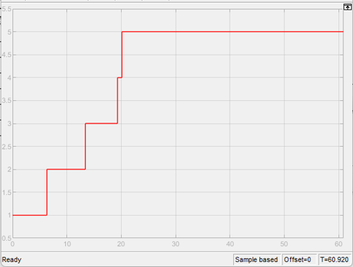
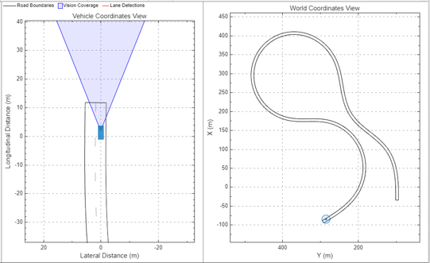

# Simulation results

## 2D simulation

### Steering angle [rad]
![Steering angle[rad]](2D/SteeringAngle.png)

The steering wheel angle shows corrections within the range of -0.6 to 0.6 radians. Minor oscillations appear between 25 and 45 seconds, but due to the 15:1 steering gear ratio, only a fraction of this is transmitted to the wheels. The signal reflects fine, normal lane-following corrections.

### Lateral offset [m]
![Lateral offset[m]](2D/LateralOffset.png)

The lateral offset plot shows that the vehicle remained within the lane throughout the simulation with no significant deviations. Minor fluctuations are present, as the vehicle continuously makes small corrections to maintain the lane centerline. With no sudden swings or extreme values, this behavior indicates stable and safe lane following.

### Speed command [km/h]
![Speed command[km/h]](2D/SpeedbyController.png)

This plot shows the speed command issued by the Controller subsystem. The system commands the vehicle to maintain speeds between 90 and 150 km/h. Peak values correspond to short straight sections (zero curvature), while on sections with high curvature, the system commands a safe speed of 90 km/h.

### Speed of the vehicle [km/h]
![Speed of the vehicle[km/h]](2D/SpeedbyVehicle.png)

The actual vehicle speed gradually accelerates from 0 to the commanded speed (90 km/h). Once reaching the target, it maintains the speed stably. The vehicle speed precisely follows the command signal.

### Gear

The gear plot shows the vehicle gear ratios. The transmission operates correctly during continuous acceleration.

### Final result

The final result shows the vehicle at the end of the test track. The autonomous vehicle successfully completed the predefined test track without errors. It followed every curve and transition section flawlessly, without deviation or instability. This demonstrates the effectiveness of the control system. The image shows the vehicle and track, clearly indicating that the car successfully navigated the curved and narrowing sections of the track.

## 3D simulation

The video below shows the vehicle navigating the test track in the Unreal Engine-based 3D simulation environment.