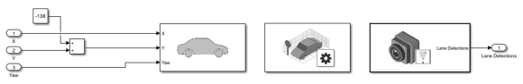

## 3D Simulation subsystem

This subsystem is responsible for simulation in the Unreal Engine-based environment.
A constant value is added to the Y position from the vehicle model to ensure the vehicle starts at the correct position on the loaded track.

The block on the left is the **Simulation 3D Vehicle with Ground Following**, which serves a similar function to the Scenario Reader block in the 2D Simulation subsystem. It guides the selected vehicle along the track based on the provided information (X, Y coordinates and Yaw orientation).

The middle block is the **Simulation 3D Scene Configuration**, which selects the track and camera viewpoint. The camera is currently attached to the vehicle.

The block on the right is the **Simulation 3D Vision Detection Generator**, which implements the camera mounted on the vehicle (the simulation is viewed from its perspective). It performs the same function as the Vision Detection Generator block in the 2D Simulation subsystem, implementing the windshield-mounted camera. Its output provides the detected lane information, which is then extracted and processed by the control system to perform lane keeping.

**Inputs:** X, Y, yaw  
**Output:** detected lane informations
