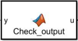

## Check_output block

The Check_output block verifies the controller output and ensures that the vehicle model input receives a valid value. It must exclude empty or NaN (Not a Number) values, which would effectively result in the loss of the controller output signal and lead to unpredictable vehicle behavior.

**Input:** u – controller output  
**Output:** y – validated signal (0 if input is empty or NaN, otherwise the original value)
