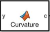

## Curvature block

The Curvature block converts road curvature to steering angle. According to the kinematic vehicle model, where L is the wheelbase, δ is the steering angle, and κ is the road curvature:

κ = tan δ / L

Solving for δ:

δ = arctan(L ∙ κ)

**Input:** curvature κ [1/m]  
**Output:** steering angle δ [rad]
