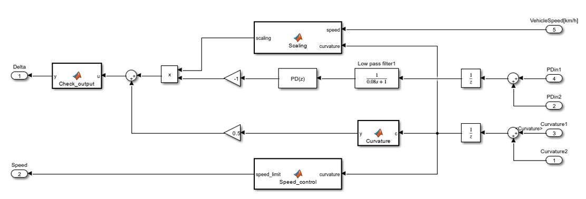

## Controller subsystem

The complete subsystem control the steering and speed of the vehicle. Signals can arrive only on either the PDin1 and Curvature1 inputs or the PDin2 and Curvature2 inputs, depending on whether running a 2D or 3D simulation.
Although other controllers (e.g., MPC) could have been used, the system is built on a PD controller due to its simpler implementation and lower computational requirements.

The error signal passes through a Unit Delay block and a first-order low-pass filter with a cutoff frequency of 2 Hz before reaching the PD controller. The Unit Delay prevents algebraic loops in the system, while the filter removes disturbances that could cause improper controller operation. The negative sign is important because steering must be applied in the opposite direction of the error.
Before the steering signals are summed, the controller output is scaled by the Scaling block. The road curvature signal also passes through a Unit Delay block to prevent algebraic loops, then after passing through the Curvature block and weighting, it is added to the controller output.

**Inputs:** PDin1, PDin2 (error signals), Curvature1, Curvature2 (road curvature)  
**Output:** SteeringAngle [rad], Speed [km/h]
