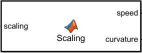

## Scaling block

The Scaling block calculates a scaling factor for the PD controller based on vehicle speed and road curvature. The base scaling value is 1, to which the product of curvature gain and speed factor is added. The curvature gain scales the effect of curvature, increasing the scaling factor for larger curvature values while approaching a maximum limit of 1. The speed factor reduces the scaling value at high speeds, making the control action less sensitive. The output is limited to a safe range between 1 and 2.5.

**Inputs:** speed [km/h], curvature [1/m]  
**Output:** scaling factor [1 – 2.5]
