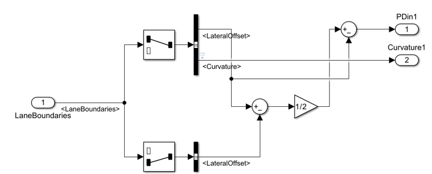

## Detections subsystem

This subsystem processes data from the windshield-mounted camera and generates control signals for the steering controller.

The input is **LaneBoundaries**, a bus containing road information detected by the sensor. Selector blocks extract the left and right lane boundary information, from which Bus Selector blocks select the following signals:

* **LateralOffset** – distance from vehicle center of mass to left lane boundary
* **LateralOffset** – distance from vehicle center of mass to right lane boundary
* **Curvature** – road curvature

The PD controller error signal (PDin1) is calculated as follows: the lane centerline value is subtracted from the distance between the vehicle center of mass and the left lane boundary. Ideally, when the vehicle is driving in the center of the lane, this difference is 0.

The lane centerline value is obtained by taking the distances from the vehicle to the left and right lane boundaries, summing them with proper sign, and dividing by two.

The steering control loop also uses road curvature (Curvature1), which is passed through without modification.

**Input:** LaneBoundaries (bus signal)  
**Outputs:** PDin1 (error signal), Curvature1 (road curvature)

