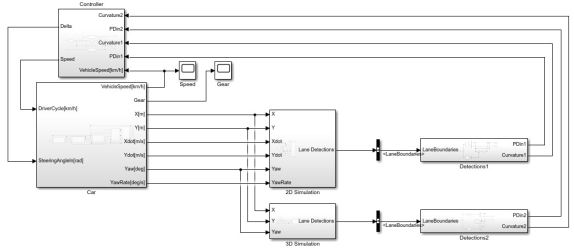

## Model

When the simulation starts, the Car subsystem provides the necessary vehicle information to the 2D or 3D Simulation subsystems.
During simulation, a Bus Selector block extracts the **LaneBoundaries** bus from the camera data, which is then processed by either the Detections1 or Detections2 subsystem. The processed signals are used by the Controller subsystem to generate steering and speed control commands. These commands then control the vehicle in both longitudinal and lateral directions.

**Data flow:** Car subsystem → 2D/3D Simulation subsystem → Bus Selector → Detections subsystem → Controller subsystem → Car subsystem

